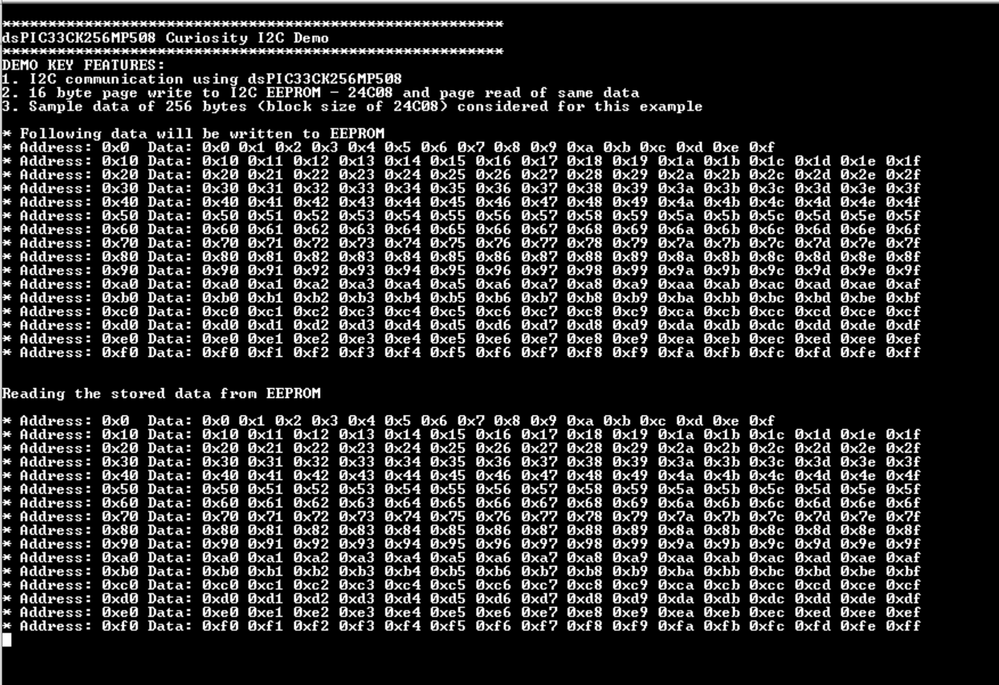
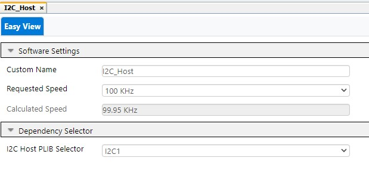
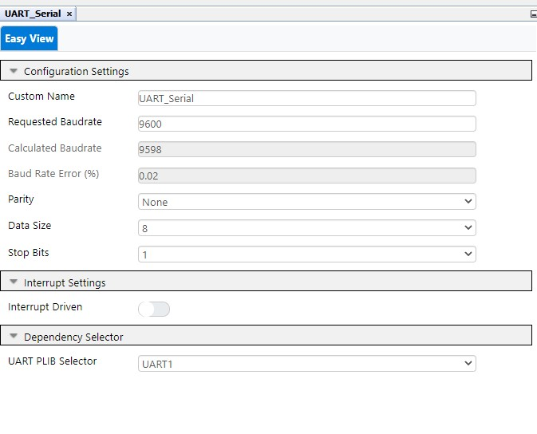
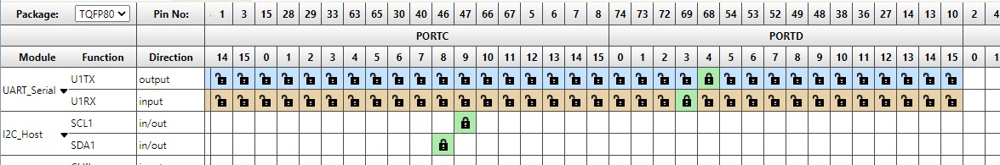

## dsPIC33CK Curiosity Development Board - I2C Demo

## Summary

This project demonstrates the I2C communication on dsPIC33CK Curiosity board using MCC- Melody driver code.

Demo code will write upto 256 bytes of message typed on serial terminal to EEPROM and reads back the written message.

This example uses 24C08 based I2C EEPROM click board with block size of 256 bytes and each page consists 16 bytes.

## Related Documentation

[dsPIC33CK256MP508 datasheet](https://www.microchip.com/dsPIC33CK256MP508) for more information or specifications.

## Software Used

- [MPLAB® X IDE v6.00](https://www.microchip.com/mplabx) or newer
- [MPLAB® XC16 v2.00](https://www.microchip.com/xc16) or newer
- Device Family Pack : dsPIC33CK-MP_DFP v1.8.224
- [MPLAB® Code Configurator (MCC) 5.1.17](https://www.microchip.com/mcc) or newer
- Tera Term or any serial terminal

## Hardware Used

- [dsPIC33CK Curiosity Board](https://www.microchip.com/dm330030)
- [I2C EEPROM Click](https://www.mikroe.com/eeprom-click)

## Setup

**Hardware Setup**

- Plug the [I2C EEPROM Click](https://www.mikroe.com/eeprom-click) to `mikroBUS A/B` of Curiosity board
- Connect micro-USB cable to port `J7` of Curiosity board to PC for viewing debug messages.

**MPLAB® X IDE Setup**

- Open the `dspic33ck-curiosity-i2c-eeprom-demo.X` project in MPLAB® X IDE
- Build and program the device

## Operation

- Demo code records upto 256 bytes of charecter in EEPROM which is 1 block size of 24C08
- Pressing `enter key` (carriage return) once will jump to next page write and twice will abort the recording
- Recording is aborted either by pressing return key twice or after 256 bytes of data  
  

## MCC settings for reference

This Project uses the driver code generated by **MCC-Melody**.

**I2C-Host Configuration**

- I2C Host Configuration done in MCC Melody User Interface for this demo code 
  

**UART Configuration**

- UART Configuration done in MCC Melody User Interface for this demo code  
  

**PIN Configuration**

- I2C pins: RC9 for SCL1 and RC8 for SDA1
- UART Pins: RD4 as U1TX and RD3 as U1RX 
  
